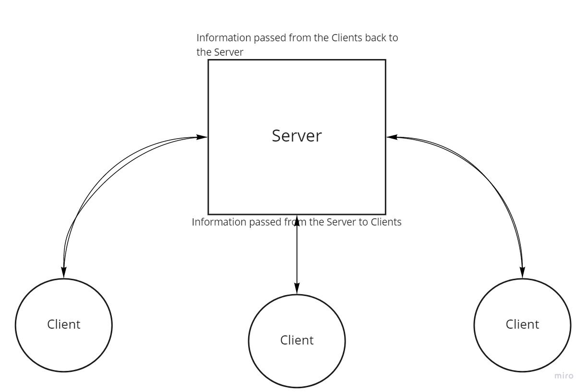

# Caps-Phase-3
 
 ## Description: 
 This is a demonstration of the Socket.io system involved in an order delivery system called CAPS. The way this App works is by using WebSockets, information is passed from Server to Clients and vice versa allowing for a seamless delivery tracker currently working in simulation but this could be updated to work in real time over the internet using **Ngrok** or another Socket service.

 ### App Version_: 1.0

### Languages and Tools used:
JavaScript, Node.js, Socket.io, Faker

### UML:
